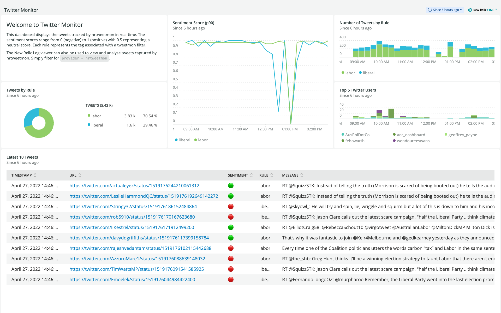
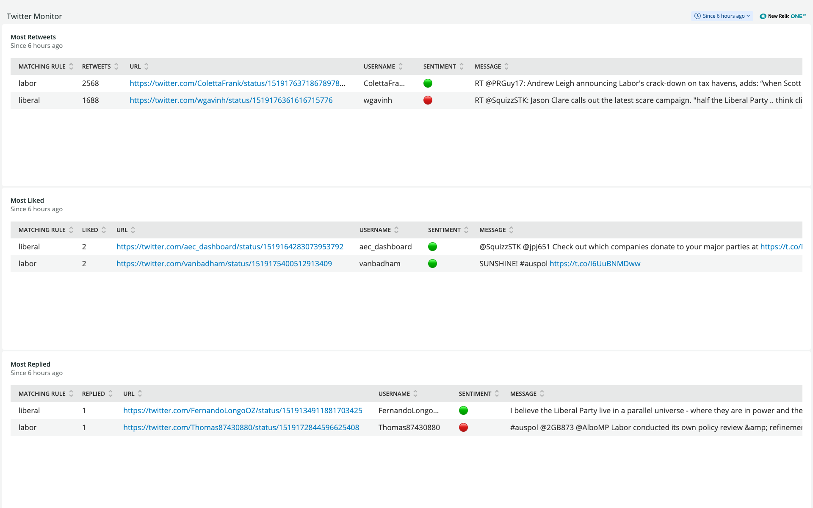
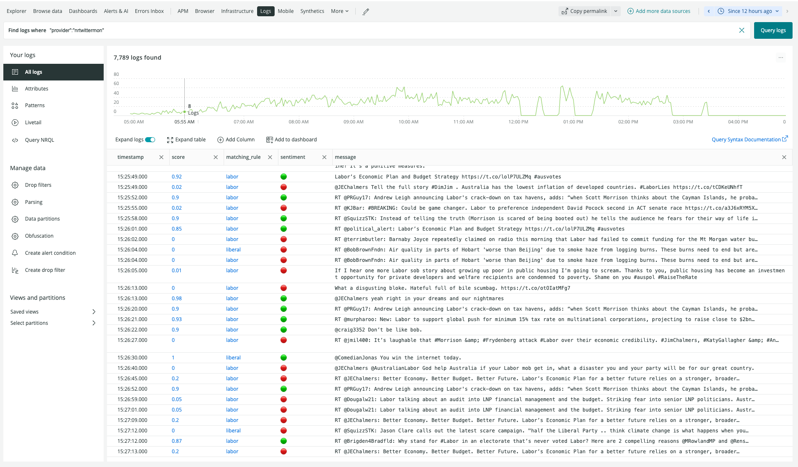

# Twitter Monitor with Sentiment Analysis

## Description

This taps into the Twitter streaming API to filter tweets in real-time. Matching tweets are sent to New Relic as log events that can be queried and visualised in real-time. The text of the tweet is processed by a text classificaiton model and a sentiment score and label is applied to each tweet.

## Installation
```
virtualenv venv
source venv/bin/activate
pip install -r requirements.txt
```

## Obtain Twitter v2 API access

- Sign up to Twitter v2 API using [Developer Portal](https://developer.twitter.com/en).
- Create an application environment and copy the applications bearer token.
- With elevate access this should give you access to 2 million tweets per month.

## Configuration

- Define one or more Twitter stream filter rules in `rules.yaml` that conform to Twitter filter rules [specification](https://developer.twitter.com/en/docs/twitter-api/tweets/filtered-stream/integrate/build-a-rule). Stay within the allowed number of rules associated with your application access level. Rules can be updated on the fly. Just edit `rules.yaml` and send HUP signal to process.
- You may want to negate retweets by adding `-is:retweet` to each rule. Otherwise, Twitter truncates the text of retweets.
- Add your Twitter applications bearer token to `config.py` as `TWITTER_BEARER_TOKEN = 'XXX'` or set environment variable.
- Add New Relic insert key to `config.py` as `NEW_RELIC_INSERT_KEY = 'XXX'` or set environment variable.
- Sensitive tweets are captured by default. To avoid them add `IGNORE_SENSITIVE_TWEETS = True` to `config.py` or set environment variable.
- The sentiment of tweets are analysed by default. To deactive this add `RUN_SENTIMENT_ANALYSIS = False` to `config.py` or set environment variable.
- Events are emitted to New Relic every 5 seconds. To adjust this add `NEW_RELIC_HARVEST_INTERVAL = <seconds>` to `config.py` or set environment variable.
- Adjust `logging.ini` as required. DEBUG logging is enabled by default.

## Deploy New Relic Twitter Monitor Dashboard with Terraform

```
terraform init
env NEW_RELIC_ACCOUNT_ID=XXX NEW_RELIC_API_KEY=XXX terraform apply
```

## Running
```
python nrtwittermon.py
```

## Screenshots

Overview Dashboard



Popular Tweets Dashboard



New Relic Log Viewer



## Support

This project is provided AS-IS WITHOUT WARRANTY OR DEDICATED SUPPORT. Issues and contributions should be reported to the project here on GitHub.

## Credits

- [FLAIR](https://github.com/flairNLP/flair): An easy-to-use framework for state-of-the-art NLP
- [Twitter for Python](https://github.com/tweepy/tweepy)